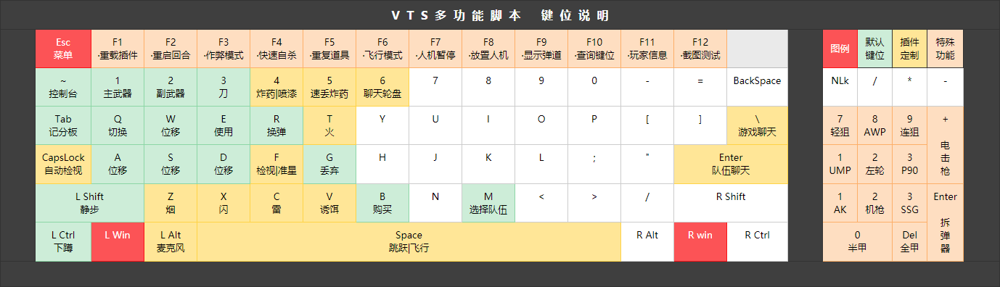

# VTS多功能插件
***
> [!IMPORTANT]
> 本插件依个人游戏习惯编写，若需使用请按注释自行配置。
## 简介
### 针对游戏<Counter-Strike 2>开发的多功能脚本 进行配置后能够实现一键换机

## 主要内容
- 游戏基础设置
- 性能与功能优化
- 新增特殊功能
- 雷达优化
- 准星定制
- 键位设置
- 其他
  
## 键位预览图

***
## 插件目录
|0. 启动项      |1.综合|2.界面|3.按键|4.标识图|
|---------------|------|-----|-------|---------|
|1.预设与说明    |1.基础|HUD  |鼠标    |         |
|2.插件加载环境  |2.声音|雷达  |主键盘  |         |
|               |      |准星 |数字键  |         |
|               |      |     |F功能键 |         |
|               |      |     |小键盘  |         |
